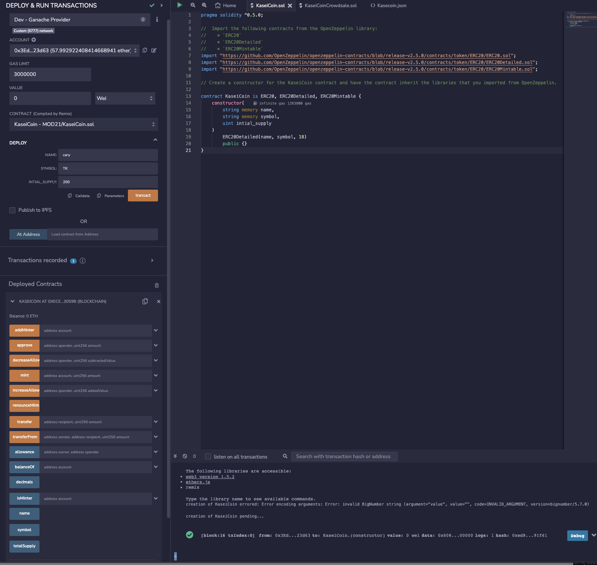
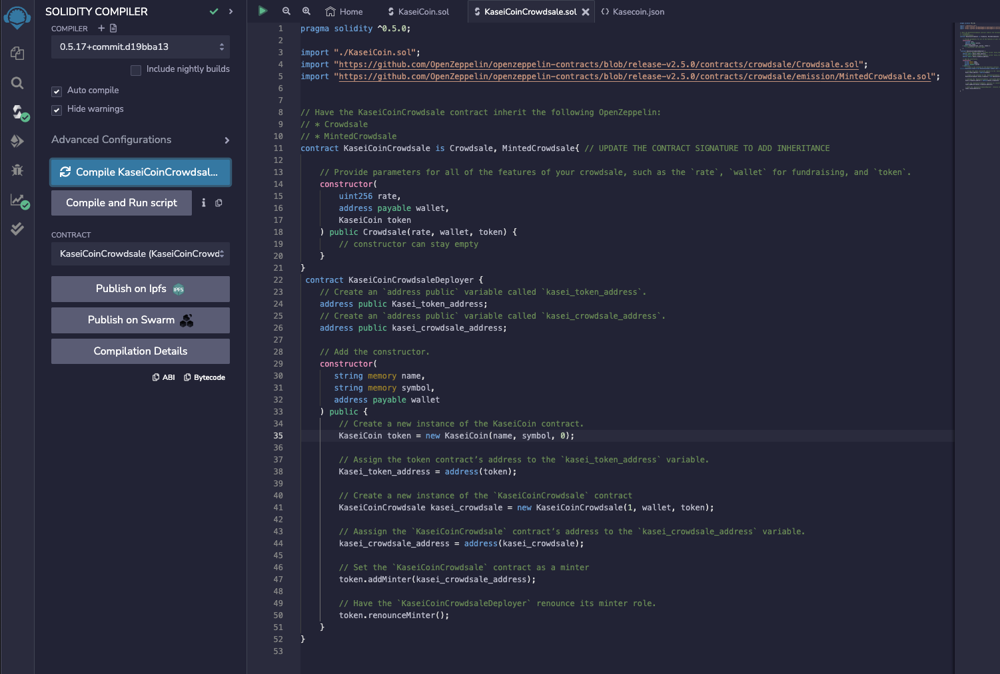
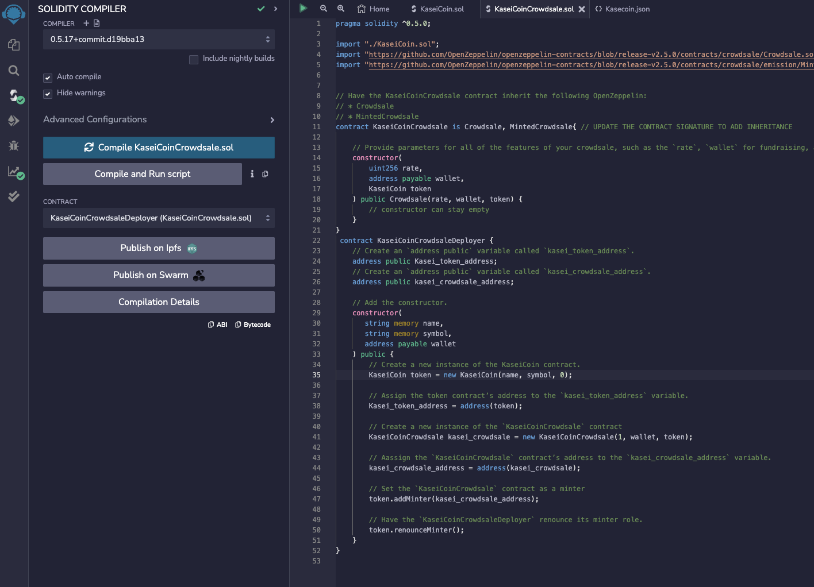
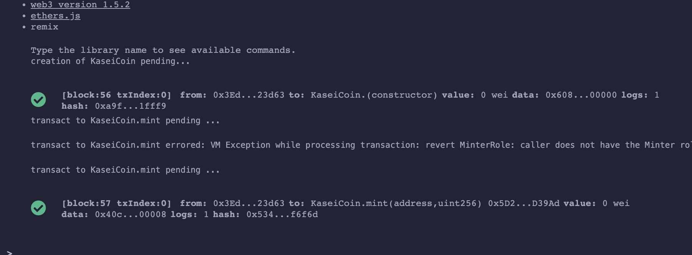

# M21_crowdfunding

## Background

This smart contract allows for the crowdfunding of a company by selling tokens.

## Technologies
- Ganache
- Remix - Ethereum IDE
- Solidity 

## Installation
First, One must Clone this Repository

Then they must activate their dev environment, Click [here](https://docs.conda.io/projects/conda/en/stable/user-guide/install/macos.html)
for detailed instructions.

## Executions 
See Deployment

See Crowdsale Compilation

See Deployer Compilation

See Token Exchange & balance

## Contributors

Cary Gutknecht, Jay Ferreira, Google, stackOverflow, UC BERKELEY EXTENSION COURSE:FINTECH-MODULE 20

## License

See LICENSE file.
